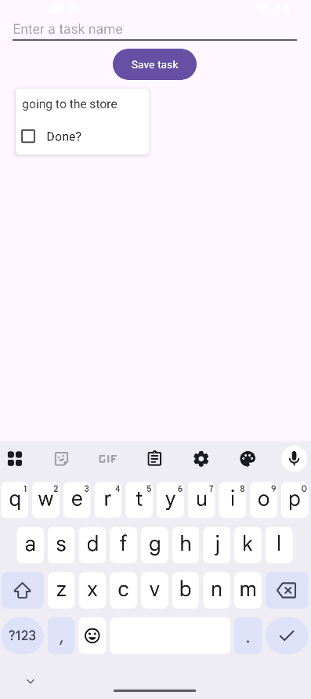
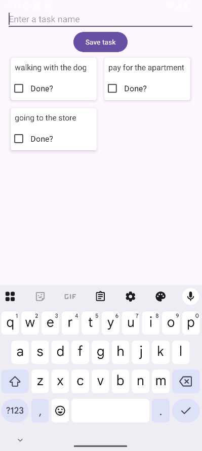
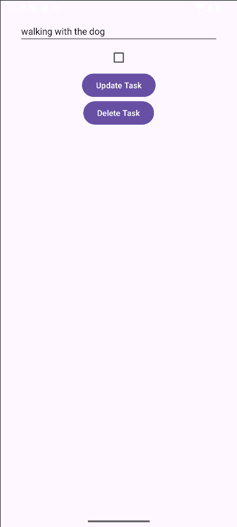
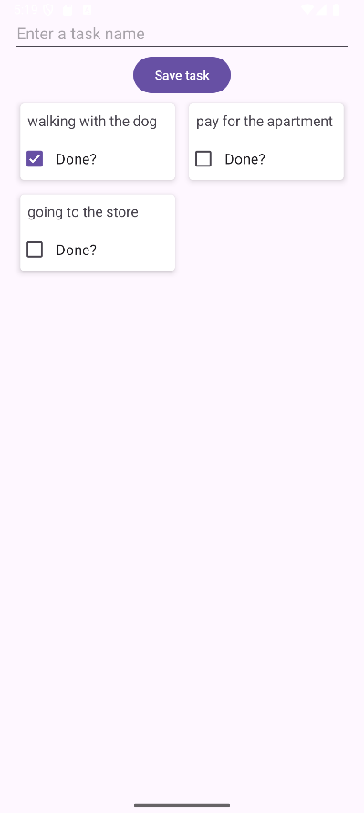
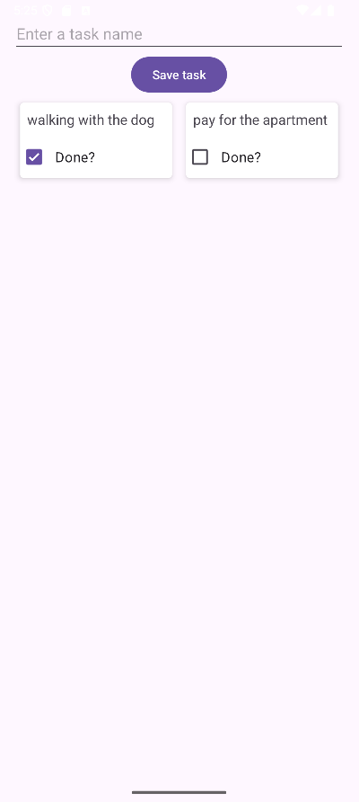

# Tasks
Учебное приложение для управления задачами (To-Do List).

# Описание
Позволяет пользователю создавать, просматривать, редактировать и удалять задачи. Задачи сохраняются в локальной базе данных на устройстве.

# Стек технологий
- Язык: Kotlin
- Архитектура: MVVM
- Android Jetpack:
  - Room для работы с локальной базой данных SQLite
  - ViewModel и LiveData
  - RecyclerView с ListAdapter и DiffUtil для эффективного отображения и обновления списка
  - View Binding
- Навигация: Navigation Component

# Ключевые навыки, демонстрируемые в проекте:
- Работа с базой данных через библиотеку Room (создание Entity, DAO, Database)
- Использование RecyclerView и адаптеров для отображения данных в списке
- Оптимизация работы списка с помощью DiffUtil
- Реализация CRUD-операций (Create, Read, Update, Delete)

# Скриншоты

  
  
  
  
  

